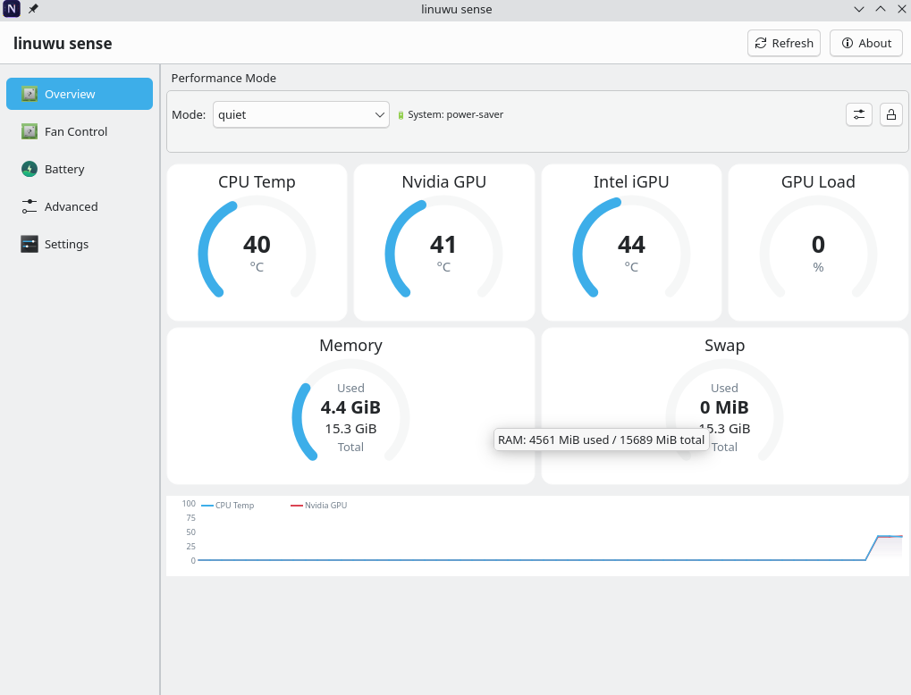
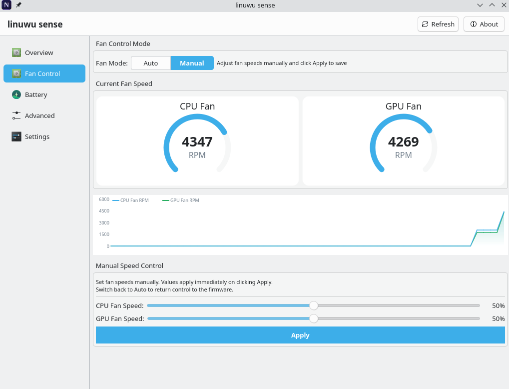
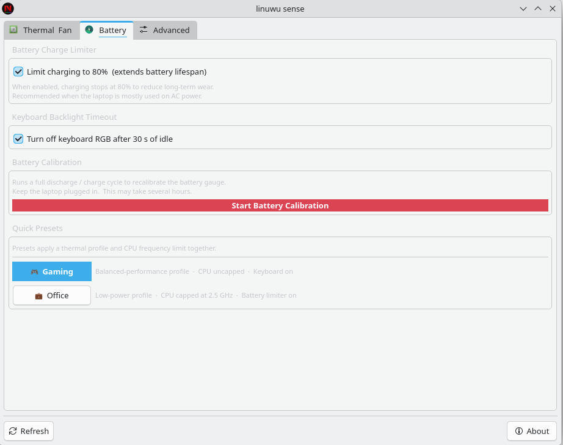
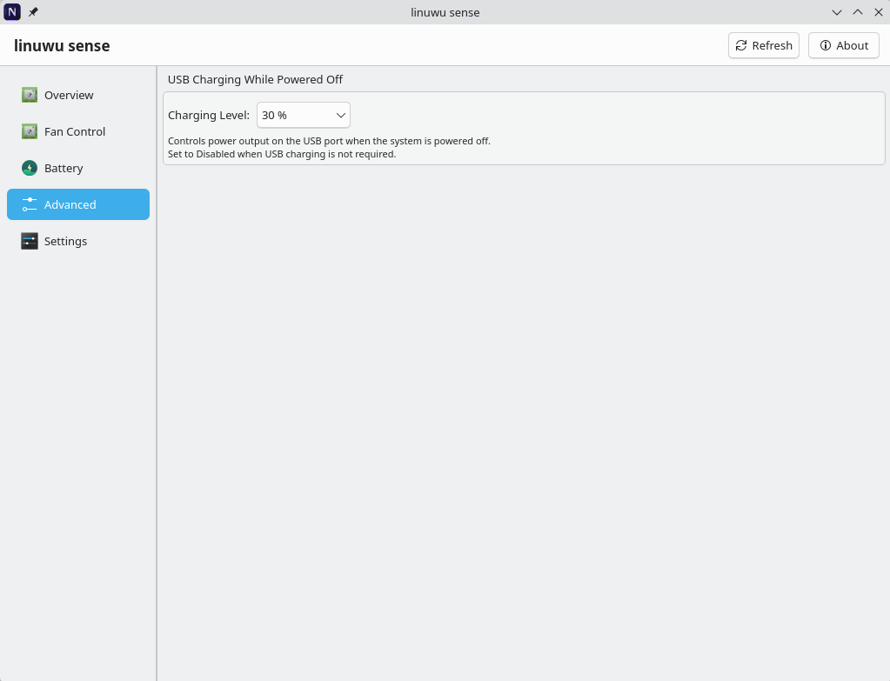
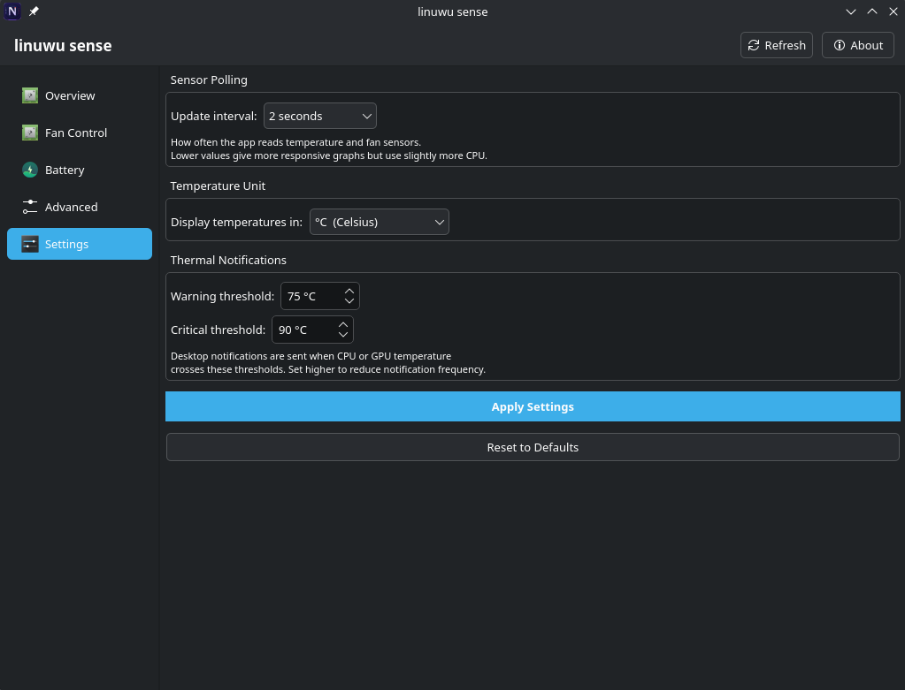

<div align="center">

# linuwu sense

**A native KDE / PyQt6 GUI for Acer Predator & Nitro laptops**

[](LICENSE)
[](https://www.riverbankcomputing.com/software/pyqt/)
[](https://kde.org)
[](https://kernel.org)

Controls hardware features on Acer Predator and Nitro laptops via the
[linuwu_sense](https://github.com/0x7375646F/Linuwu-Sense) kernel module by **0x7375646F**.  
Runs without root at runtime. Integrates fully with KDE Plasma 6.

</div>

---

## Screenshots

| Overview | Fan Control | Battery |
|:---:|:---:|:---:|
|  |  |  |

| Advanced | Settings |
|:---:|:---:|
|  |  |

---

## Features

### Thermal & Fan
- **Live gauges** — CPU temp, Nvidia/AMD GPU temp, Intel iGPU temp, CPU fan %, GPU fan %, GPU load % — all scale responsively with the window
- **History graphs** — 60-second scrolling temperature and fan speed graphs
- **Thermal profiles** — dropdown syncs with KDE's Power & Battery widget via `powerprofilesctl` (bidirectional)
- **Auto-switching** — profile changes automatically on AC plug/unplug and as battery drains (40% → Quiet, 20% → Low Power)
- **Profile lock** — lock button prevents auto-switching for the current session
- **Manual fan control** — Auto/Manual toggle with CPU and GPU sliders; applies `CPU,GPU` percentages directly to the kernel module
- **Customisable dashboard** — gear menu (KDE-style instant popup) to show/hide individual sections; preference persists across sessions

### Battery
- **80% charge limiter** — reduces long-term battery wear
- **Keyboard backlight timeout** — turns off RGB after 30 s of idle
- **Battery calibration** — triggers a full discharge/charge recalibration cycle
- **Quick presets** — Gaming (balanced-performance, CPU uncapped) and Office (low-power, CPU capped at 2.5 GHz, limiter on)

### Keyboard RGB
- **Live preview** — clickable top-view of the four zones; click any zone to open the colour picker
- **Per-zone colours** — independent colour for each of the four zones with instant hardware apply
- **Lighting effects** — Static, Breathing, Wave, Rainbow, Pulse, Flash with speed (0–9) and direction controls
- **Brightness slider** — applies to both static and effect modes
- **Colour presets** — Rainbow, Ocean, Nitro Red, White

### Advanced
- **USB charging while off** — set the charging current (Disabled / 10% / 20% / 30%) for the USB port when the laptop is powered off

### System integration
- **KDE system tray** — monochrome CPU temperature arc gauge, updates only when temperature or profile changes; right-click for quick profile switching
- **Close to tray** — closing the window hides it; the app keeps monitoring in the background
- **KDE notifications** — desktop notifications via `org.freedesktop.Notifications` at 75°C (warning) and 90°C (critical)
- **Nitro key shortcut** — the NitroSense hardware key is mapped to `XF86Launch1` and registered as a KDE global shortcut
- **First-run welcome** — one-time dialog explaining close-to-tray, the Nitro key, and auto-switching behaviour
- **No root at runtime** — a udev rule grants the `acer-nitro` group rw access to all sysfs nodes; the installer adds your user automatically

---

## Requirements

| Dependency | Notes |
|------------|-------|
| [linuwu_sense](https://github.com/0x7375646F/Linuwu-Sense) kernel module | Required — the module this GUI controls |
| `python-pyqt6 ≥ 6.7.0` | Install via your package manager or `pip install PyQt6`; `install.sh` handles this on Arch |
| `power-profiles-daemon` | Optional — enables KDE power-mode sync |
| `nvidia-utils` | Optional — enables GPU temperature and load via `nvidia-smi` |

**Supported distros:** Any Linux distro with `python3` and `pip` or a packaged `python-pyqt6`. The installer script is Arch/pacman-oriented; on other distros install PyQt6 via your package manager or `pip install PyQt6`.

---

## Installation

```bash
git clone https://github.com/friday06/linuwu-sense-gui.git
cd linuwu-sense-gui
sudo ./install.sh
```

Then **log out and back in** for the `acer-nitro` group membership and Nitro key shortcut to activate.

Launch from your app menu by searching **linuwu sense**, or:

```bash
linuwu-sense-gui
```

### Uninstall

```bash
sudo ./uninstall.sh
```

### AUR / makepkg

```bash
makepkg -si
```

---

## Kernel module

The module must be loaded before the GUI is started:

```bash
sudo modprobe linuwu_sense

# Persist across reboots
echo linuwu_sense | sudo tee /etc/modules-load.d/linuwu_sense.conf
```

---

## How fan control works

The kernel module exposes a single sysfs node:

```
/sys/module/linuwu_sense/drivers/platform:acer-wmi/acer-wmi/nitro_sense/fan_speed
```

Write format: `CPU,GPU` where each value is 0–100 (percent).  
Write `0,0` to return control to the firmware (Auto mode).

```bash
# Example: set CPU fan to 50%, GPU fan to 70%
echo "50,70" | sudo tee /sys/.../nitro_sense/fan_speed

# Return to auto
echo "0,0" | sudo tee /sys/.../nitro_sense/fan_speed
```

The GUI writes this node directly via the `acer-nitro` group permissions — no root required at runtime.

---

## Supported sysfs nodes

All nodes are relative to the sense base path (auto-detected as `nitro_sense` or `predator_sense`):

| Node | Format | Description |
|------|--------|-------------|
| `fan_speed` | `CPU,GPU` (0–100) | Fan speed %; `0,0` = firmware auto |
| `battery_limiter` | `0` / `1` | 80% charge limit |
| `battery_calibration` | write `1` | Start calibration cycle |
| `backlight_timeout` | `0` / `1` | RGB off after 30 s idle |
| `usb_charging` | `0` / `10` / `20` / `30` | USB charging current while off |
| `four_zoned_kb/per_zone_mode` | `RRGGBB,…,BRIGHTNESS` | Per-zone static colours |
| `four_zoned_kb/four_zone_mode` | `MODE,SPEED,BRIGHTNESS,R,G,B,DIR` | Lighting effects |

ACPI `platform_profile` (thermal profiles) is also managed via `/sys/firmware/acpi/`.

---

## Troubleshooting

| Symptom | Fix |
|---------|-----|
| "No features detected" | `sudo modprobe linuwu_sense` |
| Permission denied on writes | Log out and back in after install (group membership) |
| PyQt6 import error | `sudo pacman -S python-pyqt6` (Arch) or `pip install PyQt6 --break-system-packages` |
| `powerprofilesctl` not found | Install `power-profiles-daemon` via your package manager, then `sudo systemctl enable --now power-profiles-daemon` |
| GPU temp/load shows 0 | Install `nvidia-utils` / `nvidia-smi` (Nvidia) or check `amdgpu` module is loaded |
| Nitro key not working | Log out and back in; check `~/.config/kglobalshortcutsrc` |
| Tray icon missing | Check that a system tray is running in your Plasma panel |

---

## Credits

- **0x7375646F (sudo)** — [linuwu_sense kernel module](https://github.com/0x7375646F/Linuwu-Sense)
- **friday06** — linuwu-sense-gui application

See [CREDITS](CREDITS) for full details.

## License

[GPL-3.0-or-later](LICENSE) — same license as the linuwu_sense kernel module.
